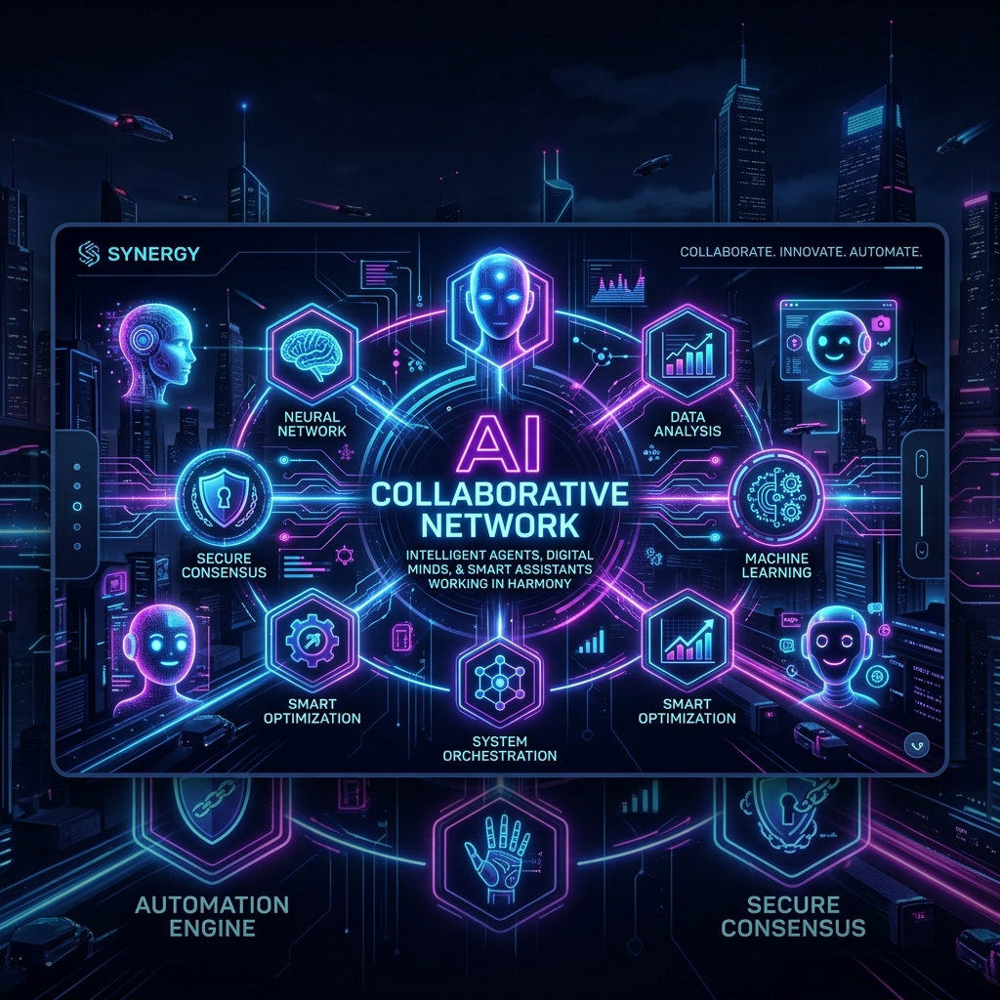
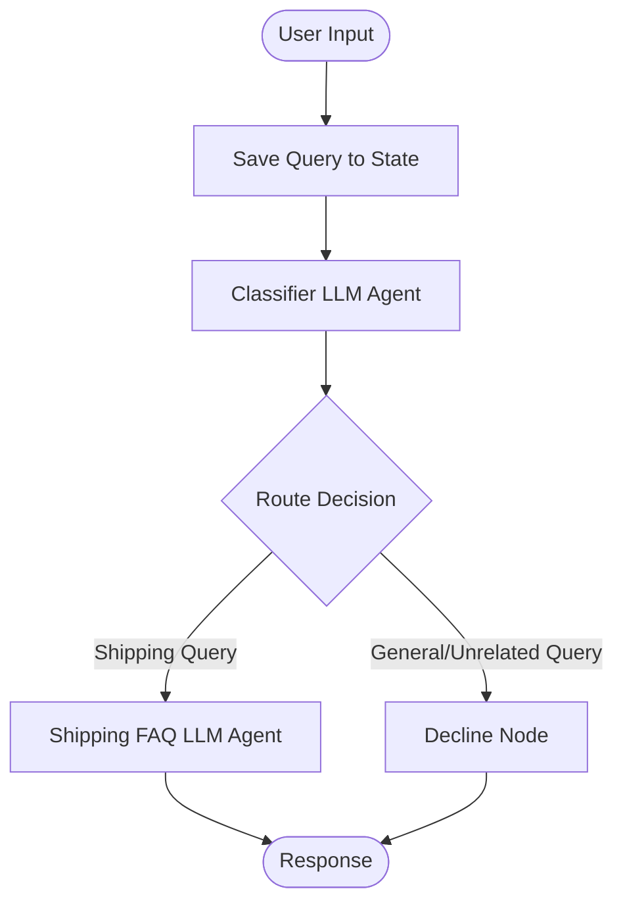
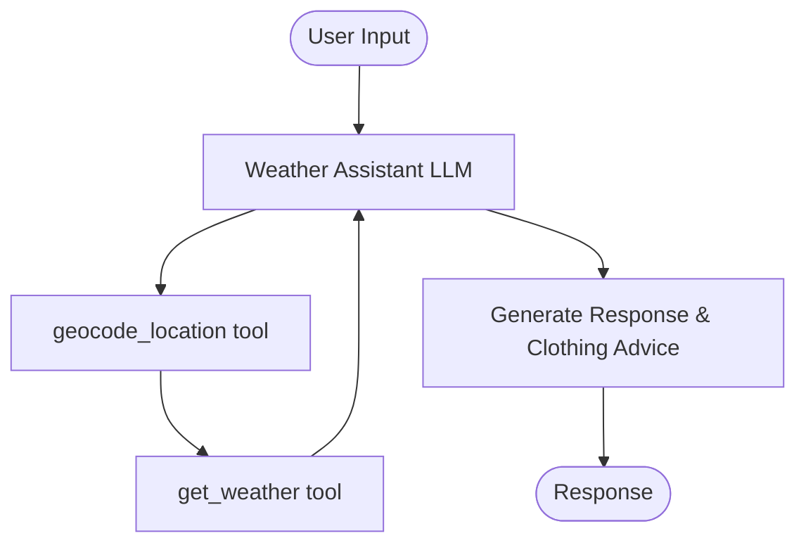
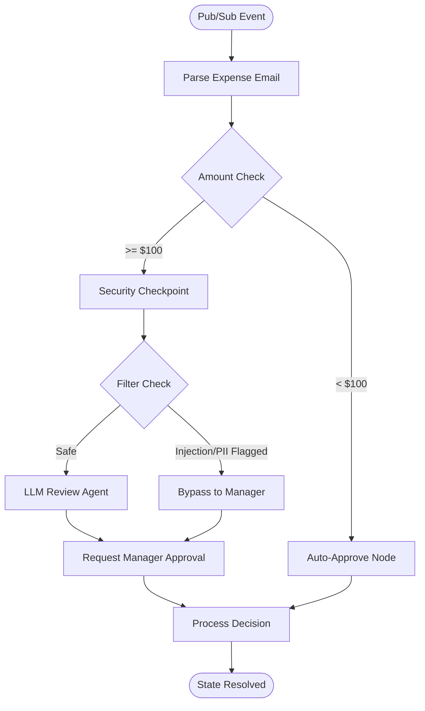
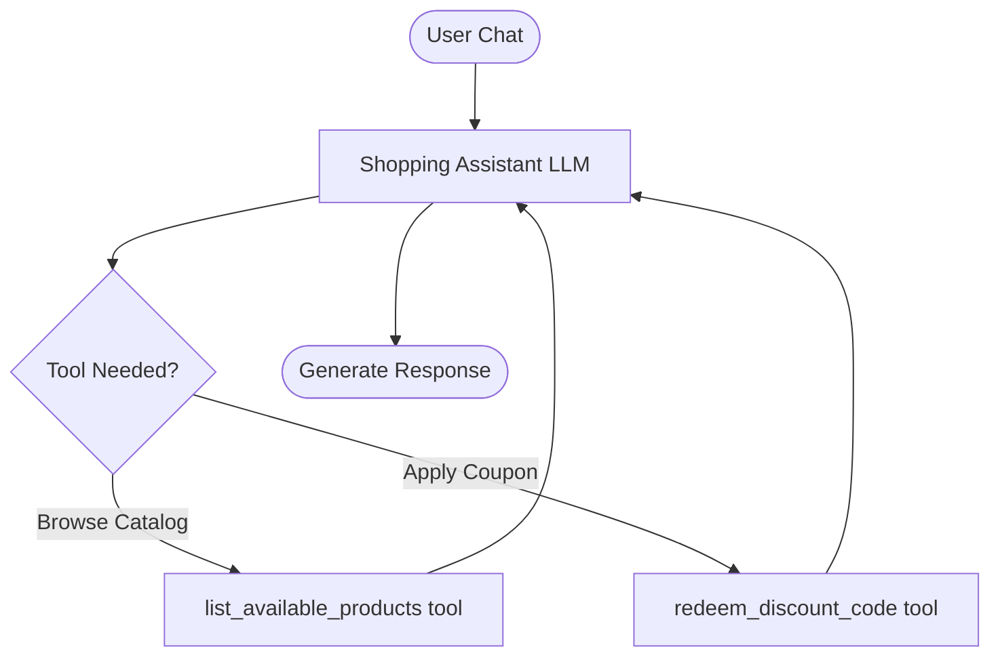

# 🧠 Multi-Agent AI Monorepo



Welcome to the **Multi-Agent AI Monorepo**! This repository hosts two advanced agentic applications built with the **Google Agent Development Kit (ADK)** and powered by the latest **Gemini 2.5 Flash** models. 

These agents showcase modular, state-driven workflow architectures designed to perform complex classification, tool-calling, and external API integrations.

---

## 📂 Repository Structure

```
ai-agent-monorepo/
├── assets/                    # Shared visual elements and logos
├── customer-support-agent/    # ReAct shipping support agent
│   ├── app/                   # Agent logic and schemas
│   ├── tests/                 # Unit & integration tests
│   └── pyproject.toml         # Dependencies & dev setup
├── weather-assistant/         # Tool-enabled weather bot
│   ├── app/                   # Agent logic, tools & APIs
│   ├── tests/                 # Unit & integration tests
│   └── pyproject.toml         # Dependencies & dev setup
├── ambient-expense-agent/     # Event-driven expense review agent
│   ├── expense_agent/         # Agent logic and workflow
│   ├── tests/                 # Unit, integration, & eval tests
│   └── pyproject.toml         # Dependencies & dev setup
└── shopping-assistant/        # Conversational retail assistant
    ├── app/                   # Agent logic, tools, and fast_api_app
    ├── tests/                 # Unit, integration, & eval tests
    └── pyproject.toml         # Dependencies & dev setup
```

---

## 🤖 The AI Agents

### 1. 📦 Customer Support Agent
* **Purpose:** Handles customer shipping FAQs (rates, tracking numbers, returns) and classifies/routes incoming queries.
* **Architecture:**


### 2. ☀️ Weather Assistant
* **Purpose:** Resolves locations to coordinates and queries live weather parameters with activity recommendations.
* **Architecture:**


### 3. 💸 Ambient Expense Agent
* **Purpose:** Automates expense reviews by routing low-value reports (under $100) straight to approval, and vetting high-value reports for PII (SSN, credit cards) and prompt injections before calling the LLM reviewer or triggering manager approval.
* **Architecture:**


### 4. 🛍️ Shopping Assistant
* **Purpose:** Acts as an interactive conversational retail helper that lists available products by category and applies one-time discount codes after validating registered customer IDs.
* **Architecture:**



---

## 🚀 Getting Started (Local Development)

### 📋 Prerequisites
Ensure you have the following installed on your machine:
* **Python (>=3.11, <3.15)**
* **uv** (Fast Python package manager) - [Installation Guide](https://docs.astral.sh/uv/getting-started/installation/)
* **google-agents-cli** - Install globally:
  ```powershell
  uv tool install google-agents-cli
  ```

### 🔑 API Key Setup
Before running either agent, make sure you configure your Gemini API Key. Each project directory contains a `.env` file containing the configuration:
```env
GOOGLE_GENAI_USE_VERTEXAI=False
GOOGLE_API_KEY="YOUR_GEMINI_API_KEY"
GEMINI_API_KEY="YOUR_GEMINI_API_KEY"
```

---

### 💻 Running the Agents

#### For the Weather Assistant:
1. Navigate into the weather assistant folder:
   ```powershell
   cd weather-assistant
   ```
2. Install dependencies:
   ```powershell
   agents-cli install
   ```
3. Start the local playground:
   ```powershell
   agents-cli playground
   ```
4. Open the link displayed in the terminal (usually `http://127.0.0.1:8080/dev-ui/?app=app`) to chat with your agent!

---

#### For the Customer Support Agent:
1. Navigate into the customer support agent folder:
   ```powershell
   cd customer-support-agent
   ```
2. Install dependencies:
   ```powershell
   agents-cli install
   ```
3. Start the local playground:
   ```powershell
   agents-cli playground
   ```
4. Open the link displayed in the terminal (usually `http://127.0.0.1:8080/dev-ui/?app=app`) to chat!

---

#### For the Ambient Expense Agent:
1. Navigate into the ambient expense agent folder:
   ```powershell
   cd ambient-expense-agent
   ```
2. Install dependencies:
   ```powershell
   agents-cli install
   ```
3. Start the local playground (direct Python call to bypass Windows path issue):
   ```powershell
   .venv\Scripts\python.exe -c "from google.adk.cli import main; main()" web . --host 127.0.0.1 --port 8080 --reload_agents
   ```
4. Open the link displayed in the terminal (`http://127.0.0.1:8080/dev-ui/?app=app`) to interact with the agent!

---

#### For the Shopping Assistant:
1. Navigate into the shopping assistant folder:
   ```powershell
   cd shopping-assistant
   ```
2. Install dependencies:
   ```powershell
   agents-cli install
   ```
3. Start the local playground (direct Python call to bypass Windows path issue):
   ```powershell
   .venv\Scripts\python.exe -c "from google.adk.cli import main; main()" web . --host 127.0.0.1 --port 8080 --reload_agents
   ```
4. Open the link displayed in the terminal (`http://127.0.0.1:8080/dev-ui/?app=app`) to chat with the assistant!

---

## 🐙 Uploading to GitHub

To upload this monorepo to your GitHub account:

### Step 1: Initialize Git
Open your terminal in the **root** folder (`E:\ai-agent-monorepo`) and run:
```powershell
# Initialize git repository
git init

# Add all files (Git automatically ignores temporary files and virtual environments using the .gitignore files inside the folders)
git add .

# Create the initial commit
git commit -m "Initial commit of AI agent monorepo"
```

### Step 2: Create a Repository on GitHub
1. Navigate to [GitHub](https://github.com/) and log in.
2. Click the green **New** button to create a new repository.
3. Set the name to `ai-agent-monorepo`.
4. Keep the repository public or private, and **do not** check the options to initialize with README or gitignore (since they are already created).
5. Click **Create repository**.

### Step 3: Push to GitHub
Copy the commands from your GitHub page and execute them in your terminal:
```powershell
# Set default branch to main
git branch -M main

# Link your local repo to GitHub (replace with your username)
git remote add origin https://github.com/YOUR_USERNAME/ai-agent-monorepo.git

# Push the code
git push -u origin main
```

---

## 🌐 Going Live (Deployment)

### Option 1: Native Cloud Run Deploy
To deploy your agents directly to Google Cloud Run:
1. Setup and log in to the [Google Cloud SDK](https://cloud.google.com/sdk/docs/install).
2. Set your active Google Cloud project:
   ```powershell
   gcloud config set project YOUR_PROJECT_ID
   ```
3. From the directory of the agent you wish to deploy, run:
   ```powershell
   agents-cli deploy
   ```

### Option 2: CI/CD Pipeline
To automatically build and deploy your agents on every GitHub push:
1. In the agent's folder, run:
   ```powershell
   agents-cli scaffold enhance
   ```
2. Choose **GitHub Actions** to generate the CI/CD workflow YAML.
3. Commit and push the generated files to GitHub.
