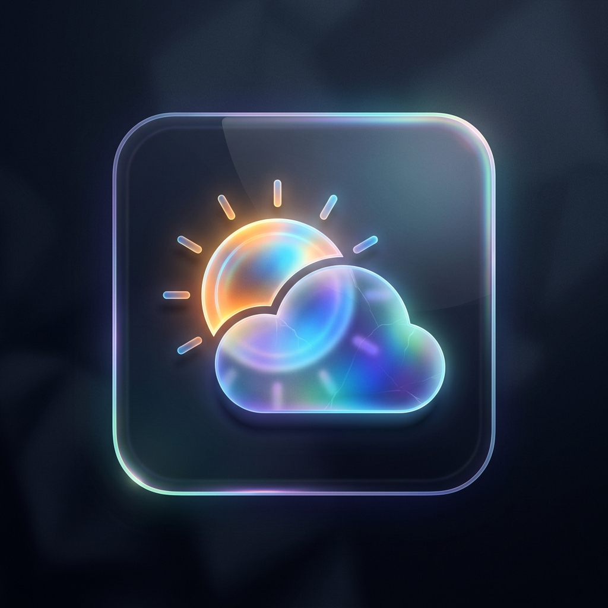

# ☀️ Weather Assistant Agent



A smart agentic assistant powered by the Google **Agent Development Kit (ADK)** and the **Gemini 2.5 Flash** model. 

This agent interacts with users to resolve location queries to exact geographic coordinates and fetch live weather conditions, short-term forecasts, and provide recommendations on clothing and outdoor suitability.

---

## 🛠️ Tech Stack & Integrations
* **LLM Engine:** Gemini 2.5 Flash
* **Geocoding Tool:** [Open-Meteo Geocoding API](https://geocoding-api.open-meteo.com/) (translates city/location names into latitude and longitude)
* **Weather Tool:** [Open-Meteo Forecast API](https://open-meteo.com/) (retrieves current temperature, apparent temperature, humidity, precipitation, and daily forecast details)
* **Runtime Environment:** Managed via Python & `uv` package manager

---

## 📂 Project Structure

```
weather-assistant/
├── app/
│   ├── agent.py               # Main agent configuration, model definition, and prompts
│   ├── tools.py               # Custom python tools (geocode, get_weather)
│   └── __init__.py            
├── tests/
│   ├── unit/                  # Unit tests for functions and tools
│   └── integration/           # Integration tests for agent flows
├── .env                       # Local environment secrets (API Keys)
├── agents-cli-manifest.yaml   # CLI configuration and metadata
├── pyproject.toml             # Dependencies management
└── uv.lock                    # Dependency lockfile
```

---

## 🚀 How to Run Locally

### 1. Install Dependencies
Make sure you are in this folder (`E:\ai-agent-monorepo\weather-assistant`) and run:
```powershell
agents-cli install
```

### 2. Set Up API Key
Ensure you have a `.env` file in the folder root containing:
```env
GOOGLE_GENAI_USE_VERTEXAI=False
GOOGLE_API_KEY="YOUR_GEMINI_API_KEY"
GEMINI_API_KEY="YOUR_GEMINI_API_KEY"
```

### 3. Run the Playground
Start the interactive developer web UI:
```powershell
agents-cli playground
```
Then chat with the Weather Assistant in your browser!

---

## 🧪 Running Tests
We provide a full suite of automated tests. Run them using:
```powershell
uv run pytest tests/unit tests/integration
```

---

## 🌐 Deploying to the Cloud
To deploy your weather assistant live to Google Cloud Run, execute:
```powershell
gcloud config set project YOUR_PROJECT_ID
agents-cli deploy
```
To set up GitHub Actions CI/CD pipeline:
```powershell
agents-cli scaffold enhance
```
Select **GitHub Actions** and commit the generated workflow files.
